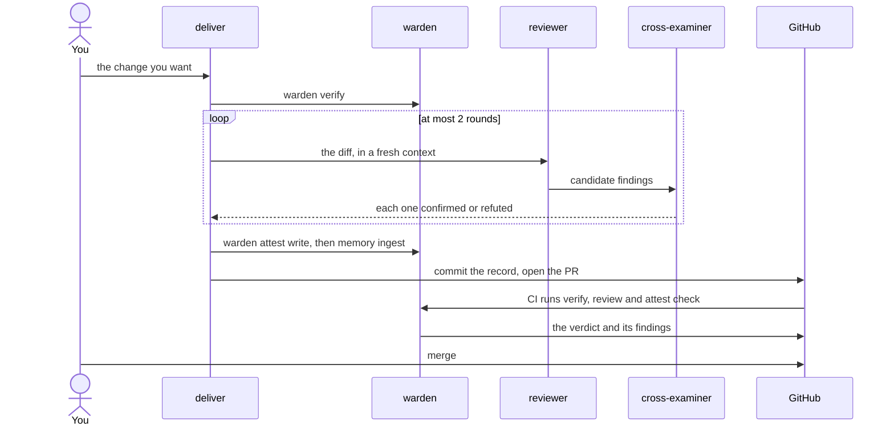

# Nightgate

**A merge gate for agent-written code that refuses what fails and records what passed.**

Nightgate is a CLI, a CI workflow and a skill pack. You declare in config what a change
must satisfy. The gate refuses a pull request that does not satisfy it, and every review
leaves a record committed with the code. There is no server to run and no paid API to call.

## The problem

An agent writes a change and the tests for it, and reports that they pass. A person skims a long diff
and merges it. Afterwards the PR shows green CI and an approval. It does not show which rules applied,
who reviewed the change, what they found, or whether it was fixed. The review that would catch a real
defect is the step that gets skipped. Nightgate makes that review a step CI checks, refusing what fails
and recording what passed against the commit it reviewed.

**[Wiki](docs/wiki/Home.md)** · [Quickstart](docs/wiki/Quickstart.md) · [Installation](docs/wiki/Installation.md) ·
[Adopting](docs/wiki/Adopting.md) · [Cost and Throughput](docs/wiki/Cost-and-Throughput.md) ·
[Architecture](docs/wiki/Architecture.md) · [Why This Exists](docs/wiki/Why-This-Exists.md)



Each step runs because the one before it can be wrong. The [sequence page](docs/wiki/Architecture-4-Sequence-Bead-to-PR.md) has every step.

## See it work

[nightgate-demo](https://github.com/NightWatchEng/nightgate-demo) is a small Node service enrolled with the
three commands under [Try it](#try-it). Each line below is copied from its CI on 2026-10-05, as kept in
[the demo record](docs/design/demo-run-20261005-v302.md). A `[...]` line marks where lines were left out.

**Refused.** [PR #2](https://github.com/NightWatchEng/nightgate-demo/pull/2) breaks a test, commits a string
shaped like an AWS access key id, and carries no review record. It stays open and red. These lines are
from the verify job, the gate's PR comment and the gate job of [run 37263095706](https://github.com/NightWatchEng/nightgate-demo/actions/runs/37263095706):

```text
    failing tests (1):
      - GET /slug with overlong text is a 400
[...]
| HIGH | `secrets-in-diff` | `src/config.js:8` | Added line introduces a AWS access key id. |
[...]
warden attest check: this PR carries no committed attestation
```

**Passed.** [PR #5](https://github.com/NightWatchEng/nightgate-demo/pull/5) adds an
option to `GET /slug`. Round 1 of review confirmed two low-severity findings, a repair
fixed both, and round 2 attested clean. It was merged. From [run 37263530985](https://github.com/NightWatchEng/nightgate-demo/actions/runs/37263530985):

```text
attest check: PASS — 2 of 3 commit(s) in origin/main..6271425f04f7 carry a committed attestation
```

## Install

```sh
uv tool install git+https://github.com/NightWatchEng/nightgate@v3.0.3
warden --version
```

That installs `warden` and `cage`. `warden --version` prints `warden 3.0.3`. If `uv`
cannot find `v3.0.3`, run `git ls-remote --tags https://github.com/NightWatchEng/nightgate v3.0.3`.
It prints one line when the tag is published and nothing when it is not.

The skill pack, which holds `deliver` and `pre-pr-review`, installs into Claude Code as below.
[Installation](docs/wiki/Installation.md) covers it in full, with [the cage](docs/wiki/The-Cage.md).

```bash
claude plugin marketplace add 'https://github.com/NightWatchEng/nightgate#v3.0.3'
claude plugin install nightgate-skills@nightgate
```

## Try it

From the root of your own Python, Node, Go or Java git repository:

```sh
uv tool install git+https://github.com/NightWatchEng/nightgate@v3.0.3
warden init
warden certify --level 3
```

`warden certify --level 3` then reports `certification: LEVEL 3 (Reviewed)` with no file written by hand. `warden init`
writes `repo.yaml` for Python, Node, Go and Java, and for every PR, platform CI runs `warden init` and `warden certify`
with that PR's wheel on a fresh repository of each. Any other language works with a hand-written `repo.yaml`, the other
files [Adopting](docs/wiki/Adopting.md) shows, and a gate job that installs `warden` as [Install](#install) does.

**What runs in CI.** `warden init` writes `repo.yaml`, starter rules, a skills policy and the gate,
`.github/workflows/warden.yml`. Commit and push them. Every pull request then runs three GitHub Actions jobs:

1. **install** fetches the platform release that `repo.yaml` pins.
2. **verify** runs the test and lint commands that `repo.yaml` declares.
3. **gate** runs `warden review`, `warden attest check` and `warden certify`. It fails if verify failed.

Make `warden gate` a required check on `main`. Other CI follows the manual steps in [the GitHub-only limit](docs/wiki/Adopting.md#another-ci-the-github-only-limit).
No job calls a model. The review skills and `engine: claude` rules run as Claude Code sessions, before the PR opens.

## How it works

- **The gate.** `warden review` runs your rules over the diff and `warden verify` runs your declared commands, in CI on every PR.
- **Two judges.** A finder lists candidate defects, and a judge in a separate context confirms or refutes each one.
- **The record.** Each review ends in `warden attest write`, its record is committed with the code, and `warden attest check` refuses a PR with no record.
- **The memory.** Past findings feed the next plan and the next review, and the `retro` skill proposes rules from them.

Two rules hold throughout. Hard stops live outside the model, and a person holds merge authority. The measured
costs are in [Cost and Throughput](docs/wiki/Cost-and-Throughput.md), and [Why This Exists](docs/wiki/Why-This-Exists.md) says what is not yet proven.

## Documentation

- **[Quickstart](docs/wiki/Quickstart.md)** · enroll a repository and land a reviewed PR.
- **[Adopting](docs/wiki/Adopting.md)** · each file `warden init` writes, and how to write it by hand.
- **[Skill Pack](docs/wiki/Skill-Pack.md)** · `deliver`, `ship`, `pre-pr-review` and the rest.

## Contributing

[Issues](https://github.com/NightWatchEng/nightgate/issues) need no paperwork. Pull requests are taken under the [contribution terms](CONTRIBUTING.md),
and they land as [Landing a change here](CONTRIBUTING.md#landing-a-change-here) describes.

## License

Nightgate is **source-available, not open source**, under the [PolyForm Shield License 1.0.0](LICENSE.md),
copyright NightWatchEng. You may use it and copy it into your own repositories. You may not offer it, or
anything substantially derived from it, as a competing product or service. The license text is authoritative.
