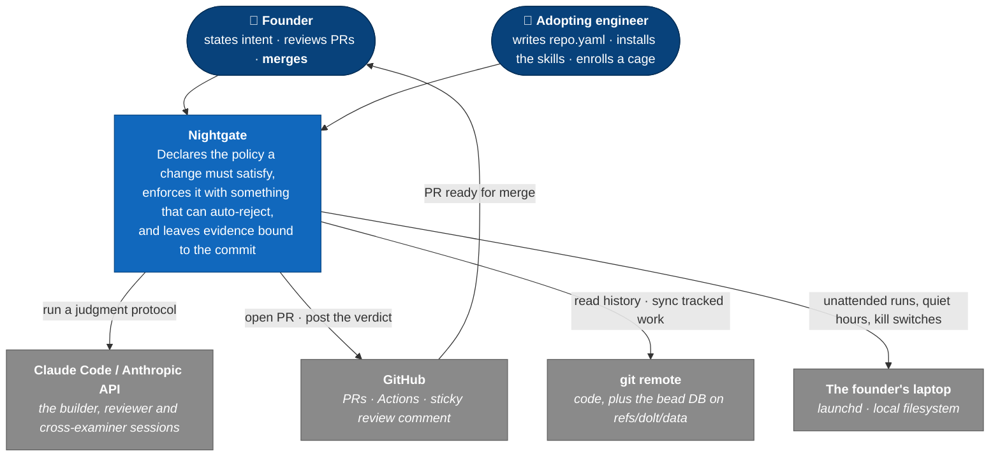

# Level 1 — System Context

The highest zoom: **who** uses Nightgate and **which external systems** it touches.
Nightgate is a single box here on purpose — the internals come at
[Level 2](Architecture-2-Containers.md).

**Reading it:** two humans and four external systems, and the shape of the box
list is the argument. The **founder** is drawn as a distinct actor from the
adopting engineer because merge authority is a role, not a permission — it never
transfers, its execution may be delegated by explicit instruction on the terms
`graph.yaml`'s `review.delegation` declares, and that delegation is revocable —
the terms are recorded there, the grant itself never is. The **adopting engineer** touches
Nightgate only through config: `repo.yaml`, a rules directory, a policy file, a
`cage.toml`. Nobody forks the tooling.

What is *not* here matters as much. There is no Nightgate server, queue, database
service or hosted dashboard, because there is no such thing to draw — the
**$0 standing infrastructure** commitment means every box above is either a CLI
invocation, a CI job, or a cron entry on a laptop. And there is no paid ingestion
API: the platform reads git, GitHub, and local files. The only metered external
call is to the Anthropic API, made by the judgment sessions themselves.

| Edge | Protocol / notes |
|---|---|
| Founder → Nightgate | A stated requirement (`/nightgate-skills:ship …`) or a tracked item picked from `bd ready` |
| Adopting engineer → Nightgate | Config only — `repo.yaml`, `.warden/rules/`, `.warden/skills-policy.md`, `cage.toml`, `graph.yaml` |
| Nightgate → Claude Code / Anthropic | Local CLI sessions running the skill-pack protocols; the only metered dependency |
| Nightgate → GitHub | Two paths, deliberately, and the line between them is now the COMMAND rather than the binary: the skill pack, the cage runner and `warden ship` shell out to `gh` (PR create, PR edit, PR back-pressure); everything CI runs — `warden review`'s sticky comment above all — goes over **stdlib HTTPS with `GITHUB_TOKEN`** and touches no `gh`, so CI behaviour does not vary with the runner's bundled `gh` version. `warden ship` is a LAPTOP command (it pushes and opens the PR, and runs in no workflow), so its `gh` dependency is the skill pack's, not CI's — and it is a hard one: a step it cannot evaluate refuses |
| Nightgate → git remote | Plain git — commit history is the corpus the rule advisor and backtests read; tracked work syncs on `refs/dolt/data` |
| Nightgate → laptop | `launchd` fires the cage runner; kill switches and overrides are files under `$HOME` |
| GitHub → Founder | The PR plus its evidence chain — the founder is the last node in every path |
