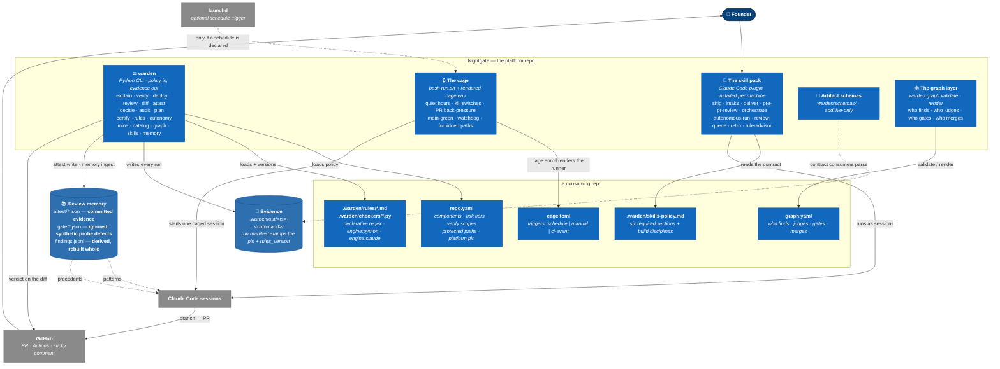

# Level 2 — Containers

Zoom into the Nightgate box: the separately runnable pieces, where each actually
executes, and what a consuming repo holds. In C4 a "container" is a runtime unit —
an app, a service, a store — not a Docker container. There is no long-running
process anywhere on this diagram; every unit is a CLI invocation, a CI job, or a
cron-fired script.

**Reading it:** the platform column ships **behaviour**; the consumer column is
**only config**. That split is the portability claim, and it is a standing CI
check rather than a promise — consumer configs must keep validating against the
shipped schemas.

Three details on the diagram are load-bearing:

- **The two memory edges carry different information.** Reviewers get *patterns*
  ("this recurred here"); cross-examiners get *precedents* ("this was refuted
  here"). Feeding both the same history would make the two judges agree for a
  reason unrelated to the diff, which destroys the decorrelation the whole review
  shape is built on.
- **"Shards are committed" is the wrong rule; "attest shards are committed" is the
  right one.** `attest/*.json` shards have collision-free names and are evidence,
  so they land in git. `findings.jsonl` is rebuilt whole by every `warden memory
  ingest` — tracking it makes every reviewing branch conflict with every other.
  And `gate/*.json` shards are *also* shards and are deliberately ignored: they
  record synthetic defects from mutation probes, so one `git add -A` after a probe
  would commit fabricated findings into the shared corpus. Three paths, and
  [Adopting](Adopting.md) tells a reader to ignore two of them by name.
- **`launchd` is a dashed, optional edge.** `cage enroll` renders a plist only when
  a `schedule` trigger is declared; `manual` and `ci-event` are the other two, and
  every hard stop in the runner holds however the run started.

| Unit | Runs where | Lifetime |
|---|---|---|
| warden | Laptop and CI. **Consumers** run the release tag their `platform.pin` names; this repo runs its own package via `uv run --project`, unpinned — a platform cannot pin itself to a past version of itself | One invocation |
| The cage | Laptop, outside the project worktree so a caged session cannot edit it | One run, resumable from a checkpoint |
| The skill pack | Installed once per machine from this repo's plugin marketplace, added by its GitHub URL, so it resolves in any checkout or worktree | One session |
| Review memory | Committed shards in the repo; the query cache is rebuilt on demand | Permanent / derived |
| Evidence | `.warden/out/`, one timestamped directory per command | Permanent |
| The graph layer | Wherever warden runs — `graph validate` is a CI gate, `graph render` draws the org chart | One invocation |
| Artifact schemas | Additive-only — consumers parse these, so a removal is a breaking change | Versioned with the platform pin |
