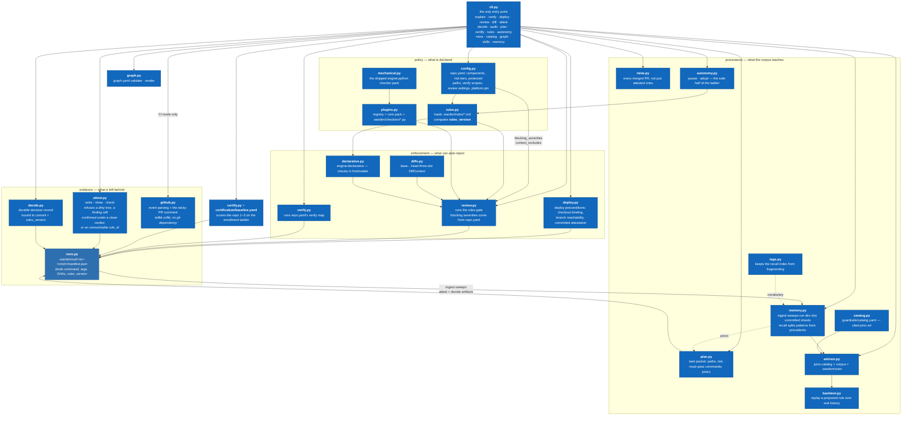

# Level 3 — Component: inside warden

Zoom into the `warden` container: the modules behind the gate, and which
subcommand reaches which. This is the level where "policy → enforcement →
evidence → provenance" stops being a slogan and becomes a call graph.

> **Arrow convention on this page:** an arrow means **A hands data or work to
> B** — data flow, not Python import direction. The two disagree in places
> (`memory.py` imports from `attest.py`, but the shards flow the other way),
> and a page that mixes the two conventions cannot be used to reason about
> direction at all. Dashed arrows are advisory inputs: they inform a step
> without gating it.

**Reading it:** the four sub-graphs are the four commitments, in order — and
two of the arrows crossing between them are the ones worth arguing about.

- **`rules.py` is what makes `rules_version` meaningful.** The hash is
  computed over the rule files, the findings schema, `mechanical.py`, the
  project's own `.warden/checkers/*.py`, and repo.yaml's `review:` subtree
  (canonicalized) — so a rule edit, a `params` change, a checker edit, or a
  `blocking_severities` / `context_excludes` flip all move it. What it
  deliberately does **not** cover: repo.yaml keys outside `review:` —
  components, risk tiers, protected paths, verify commands steer planning
  and verification, not the review verdict, and hashing them would churn
  attestation cohorts on unrelated edits.
- **No repo-specific fact lives in a module.** Tiers, paths, symbols and fixture
  names arrive from `repo.yaml` or a rule's frontmatter `params` — never from
  `config.py` or `mechanical.py`. A test greps the package to keep it that way;
  the failure mode it prevents is a shadow copy of the policy inside the code
  that enforces the policy.
- **Every command that produces new evidence writes a run directory.** Not every
  subcommand: `attest show`, `attest check`, `audit`, `graph`, `catalog`, and
  `memory recall`/`stats` are pure reads and deliberately write nothing —
  [Adopting](Adopting.md) enumerates that exemption list, and a derivation test holds
  it against `cli.py`'s real call sites. What the invariant does say is that an
  action which *changes* the record leaves one.
- **The shard is not written by `attest write`.** `attest write` writes
  `attestation.json` into a gitignored run directory; `warden memory ingest`
  sweeps that into the committed shard under `.warden/memory/attest/`. Skipping
  ingest leaves nothing to commit — see [Level 4](Architecture-4-Sequence-Bead-to-PR.md).

| Module | Responsibility | Answers to |
|---|---|---|
| `config.py` | loads and schema-validates `repo.yaml` | fails closed on any unknown key |
| `rules.py` | loads the rules dir; computes `rules_version` | the hash every verdict is stamped with |
| `mechanical.py` · `plugins.py` | the shipped checker pack, plus the project's own | `engine: python` rules |
| `diffs.py` · `declarative.py` | the `base...head` context, and frontmatter-declared checks | `engine: declarative` rules |
| `review.py` · `verify.py` · `deploy.py` | the three things that can auto-reject | `blocking_severities`, the verify map, deploy preconditions |
| `runs.py` | one run dir per state-changing command | the manifest binding command, argv, SHAs, `rules_version` |
| `attest.py` · `decide.py` | the fail-closed evidence writers | refuse a dirty tree |
| `github.py` | event parsing and the sticky comment | stdlib HTTPS, no `gh` dependency |
| `memory.py` · `tags.py` | shards, split recall, the vocabulary index | context, never policy |
| `mine.py` · `catalog.py` · `advisor.py` · `backtest.py` | history, prior art, the gap, and the replay that costs a rule its hope | `rules recommend` / `lifecycle` |
| `autonomy.py` | the safe half of the ladder | never commits, pushes, or merges |
| `certify.py` · `graph.py` | the ladder score and the org constitution | `baseline.yaml`, `graph.yaml` |

Per-command behaviour, exit codes and artifacts: [CLI Reference](CLI-Reference.md).
