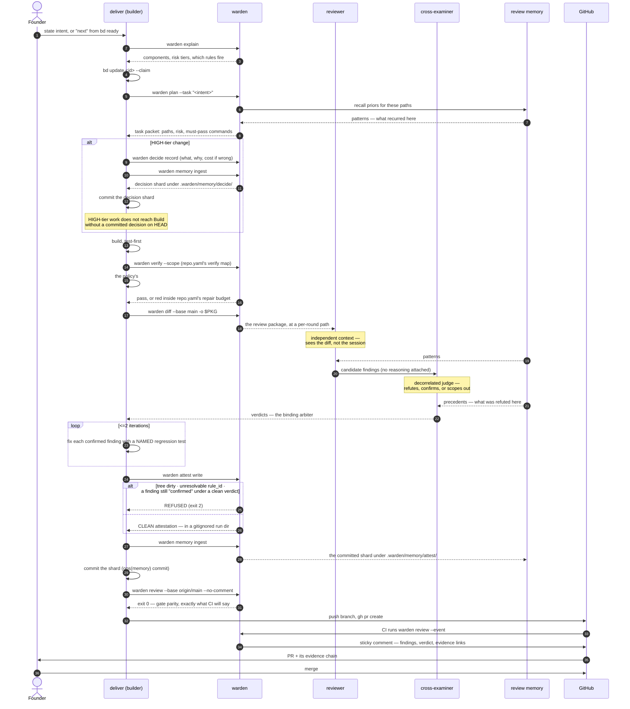

# Level 4 — Sequence: one tracked item to a merge-ready PR

The runtime flow behind every change this platform makes. Structural levels
show what exists; this shows the **order**, and the order is what the platform
sells — each step exists because the one before it can be confidently wrong.

**Reading it:** three separate judgments have to line up before a PR is even
opened, and none of them is the builder grading itself.

- **The reviewer never decides and the cross-examiner never hunts.** The reviewer
  has `authority: find`; the cross-examiner has `authority: judge` and its verdict
  is binding. The cross-examiner receives the findings *without* the reasoning
  that produced them — that is what stops the second judge from ratifying the
  first one's mistakes.
- **Both judges read the same bytes.** The package comes from `warden diff` at a
  per-round temporary path, not a live `git diff` — two concurrent rounds on one
  machine would otherwise clobber a shared file, and the two judges would be
  arguing about different ranges.
- **The two memory feeds are deliberately disjoint** (see [Level 2](Architecture-2-Containers.md)).
  Give both judges the same priors and they start agreeing for reasons unrelated
  to the diff.
- **`attest write` is a fail-closed step, not a receipt** — and it is not the step
  that produces the evidence. It refuses a dirty tree, an unresolvable `rule_id`,
  or a finding still marked `confirmed` under a `clean` verdict (a *refuted* or
  *dismissed-with-reason* finding is exactly what is meant to pass). Given
  `--review-dir`, it also refuses a **roster it can disprove**, in both
  directions — a reviewer claiming `returned: true` with no output file in
  the round directory, and a report in that directory no roster entry claims. It also
  *warns without refusing* when the findings name no file the range changed —
  the shape a stale findings file takes. What it
  writes lands in a **gitignored** run dir; `warden memory ingest` is what turns
  that into the committed shard. Skip ingest and there is nothing to commit, and
  CI's `attest check` reports a commit with no attestation.
- **Gate parity runs before the push**, not after. `warden review --base
  origin/main` is the same judgment CI will make; discovering a failure here
  costs a minute rather than a round trip. The sticky comment itself is posted by
  the CI run, over stdlib HTTPS with `GITHUB_TOKEN` — the local parity run is
  explicitly `--no-comment`.
- **The last arrow is a human.** The builder never merges, never auto-merges,
  never pushes to main. Merge authority is the founder's; delegating its
  execution takes an explicit, current, revocable grant, on the terms
  `graph.yaml`'s `review.delegation` declares — the terms are recorded there,
  the grant itself never is.

The unattended path is the *same* sequence. `autonomous-run` inside the cage runs
these steps with the hard stops of [The Cage](The-Cage.md) wrapped around them —
it does not get a shorter chain for running at 2am.

| Step | Fails how | Consequence |
|---|---|---|
| `warden verify --scope` + the policy's `## Verify` | A command exits non-zero and cannot be fixed inside `repo.yaml`'s `repair.budget` (platform cap: 2) | Revert, record, wrap — no creative workaround |
| Cross-examination | A confirmed finding that counts is still open on the original diff after the second round | Revert, record, wrap; "blocked" is a legitimate outcome |
| Repair rounds (`deliver` Build) | Two **change-defect** rounds — an open finding on the original diff, or anything above LOW — and something is still open. Review runs one round by default; the second, a scoped re-review, runs only when a round-one finding that counts was repaired. It is handed every round-one finding still open, repaired or not, re-files every one not verdicted addressed as confirmed (an unrepaired one included), and makes no repair commit. A finding under a `judges: wording` rule below every blocking severity does not count; it is fixed only in a round-one repair commit or filed as a tracked item, and one still open in round 2 is recorded dismissed-with-reason in round 2's payload, while one first raised there is kept in the round directory and named in the PR body. `warden round classify` computes which kind a round was from the round manifests' sha chain; the builder never argues it | Revert, when a finding on the ORIGINAL diff is still open. What is open only on repair-written files is adjudicated instead — parked as a tracked item, recorded. A round whose open findings are all LOW and all on files the repair COMMITS wrote (first-parent, non-merge, base-branch work subtracted only where the branch CARRIES bytes the base branch itself put at that path — a base move the branch never merged leaves the path in the set; a file in both ranges reads as repair-written) is a scaffolding round: it ends the loop early instead of counting, and its open findings are adjudicated the same way |
| `warden attest write` | Dirty tree · unresolvable `rule_id` · a finding still `confirmed` under a clean verdict · under `--review-dir`, a reviewer claiming it returned with no output file to show for it, OR a report in the directory no roster entry claims — the dropped reviewer · a `--review-dir` that is empty, missing, not a directory or unlistable | Exit 2; no PR |
| `warden attest write` (no `--review-dir`) | Nothing cross-checked the roster | Exit 0, stamped `roster_verification: unverified-roster` in the artifact and the committed shard — a permanent record that this round's crew was asserted, not checked. `round_binding` and `base_ancestry` are stamped on this path too: always, and absent is never a pass |
| `warden attest write` (no `--review-dir`, roster IS the declared light crew) | The light tier's inertness proof is recomputed from the two trees whichever way the command is called, so the tier cannot be reached by leaving an argument off | Exit 2 — the one roster this path refuses |
| `warden attest write --review-dir` (round warden did not mint, or none given) | Warden has no identity for the directory, so it cannot say which commit the reports describe | Exit 0, stamped `round_binding: unminted` (or `no-review-dir`) in the artifact and the committed shard. A round minted for a DIFFERENT head is a refusal, not a state: exit 2 — and so is a claimed report byte-identical to one in any sibling round, or to another claimed in this round |
| `warden attest write --review-dir` | A roster `role` outside the lens vocabulary, a roster entry with no `round`, a finding with no `lens` or `round`, or a finding attributed to a lens the roster does not declare as dispatched and returned in that round | Exit 2; no PR |
| `warden attest write --review-dir` (graph.yaml declares a `review` block) | A round's roster roles are not exactly that round's declared crew: a declared role is missing, or a role the round does not declare is present | Exit 2; no PR. The message names each role. With no `review` block the roster is not compared |
| `warden attest write` (advisory) | The findings name no file the attested range changed — what a stale findings file looks like | Exit 0, WARNING on stderr and in the run manifest; `rename-complete` and `wiki-fidelity` findings do this legitimately, so it never refuses |
| `warden memory ingest` skipped | No shard exists to commit | `attest check` in CI reports the commit carries no attestation |
| Gate parity | `warden review --base origin/main` exits non-zero | Fix before push; CI would say the same thing |
| CI | Any job red | Stop-the-line; a red main is an incident |
