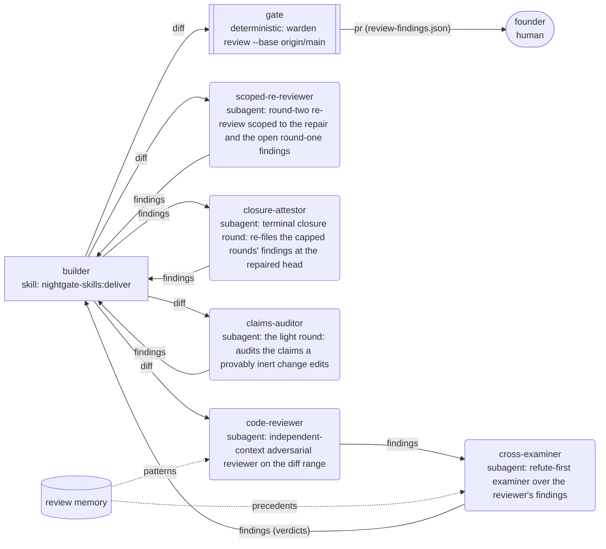

# Graph Layer

The agent organization already runs as a graph — builder, reviewer,
cross-examiner, deterministic gate, human merge — with real handoff artifacts
and edge-typed state. This layer *declares* it as versioned config instead of
leaving it as prose buried in skills.

Deliberately **not** a framework. There is no LangGraph, no AutoGen: the
runtime is Claude Code sessions, and the graph is config plus interpretation.
Design of record: [docs/design/graph.md](../design/graph.md).

## Four steps, end to end

**1 · You declare the org in `graph.yaml`** at the repo root.

**2 · `warden graph validate` refuses a graph that violates the
constitution.** Errors, not warnings:

```
$ warden graph validate
graph OK: 6 node(s), 7 edge(s), 2 memory edge(s)
```

**3 · `warden graph render` prints the org chart** as mermaid — shapes by
kind, dashed typed memory edges. The block below is this repo's own, generated
by that command and pasted verbatim; a test keeps the two identical.



Shapes carry meaning: `[[deterministic]]`, `(subagent)`, `([human])`,
`[skill]`.

**4 · Consumers read it.** `pre-pr-review` honors the declared judges and
convergence rules over its own defaults; `autonomous-run` records which node it
ran as; the cage writes that into the ledger; run manifests stamp `graph_node`.
"Who did this" is answerable from artifacts, not memory.

## The four authorities

The whole vocabulary.

| `authority:` | Means | Who may hold it |
|---|---|---|
| `find` | proposes findings; never decides whether they are real | skills, subagents |
| `judge` | confirms or refutes what a finder proposed | subagents, humans |
| `gate` | deterministic allow/deny — no judgment, no negotiation | deterministic nodes |
| `merge` | presses the button | **humans only**, enforced by validate |

**Convergence rules** say when a finding is settled — "a finding survives only
if a judge confirms it" — so an org cannot quietly define agreement as "the
finder said so".

## The constitution

`validate()` enforces; it does not suggest.

| Rule | Enforcement |
|------|-------------|
| Merge authority is **human-only** | `GraphError` — the day-one principle, machine-checked |
| `patterns` feeds only finders; `precedents` only judges | `GraphError` — anything else re-correlates the judges |
| Deterministic impls must parse; all references resolve; no self-edges | `GraphError` |
| An escalation target must be a declared node, and never the node itself; a longer cycle is refused unconditionally | `GraphError` — a cycle never terminates, budget or no budget |
| An org-wide cap that does not bound the sum of its parts | `GraphError` |
| Strings that would break the mermaid render | `GraphError` — validate and render agree by construction |
| A `review` block with an unknown role, a rule pointer at a missing file, a cap that disagrees with `repair.budget`, or a round within the cap that declares no crew | `GraphError` — see [The review crew](#the-review-crew) |
| Delegation terms granted by anyone but the merge authority, or eligible to a node that is undeclared, listed twice, or already holds merge | `GraphError` — a delegation the authority holder did not issue is self-issued; see [Merge authority](#merge-authority-and-the-delegation-of-its-execution) |
| No independent judges · orphan nodes · judges without memory edges · prose skill impls | advisory warnings |

Single-verifier flows stay loops: with only one verifier there is nothing to
cross-check against, so it is a review loop, not an organization. `validate`
warns when a graph declares no independent judges.

## The review crew

An optional `review` block declares who reviews a diff, so the crew is config
rather than skill prose. A graph without it still validates and renders.

- `rounds`: the roles dispatched in each round, in order. A role is a declared
  node with `find` or `judge` authority, or `crew:<lens id>` for a lens
  dispatched on its own, and it must be a role `attest write` accepts
  (`code-reviewer`, `cross-examiner`, `scoped-re-reviewer`, `builder`, or
  `crew:<slug>`).
- `cap`: the round cap. It must equal `repo.yaml`'s `repair.budget`.
- `lenses`: the charter lenses, complete. Each is a `checklist` the crew runs,
  or a `rule` pointer at the `<id>.md` file in the repo's rules dir
  (`review.rules_dir`, `.warden/rules` by default) that enforces it.
- `closure`: optional. The closure round — see below.
- `merge_authority`: the node that holds merge authority.

`warden graph crew --round N` prints one round as JSON: its roles, the lenses,
the cap and the node holding merge authority. It exits 1 for a round past the
cap — unless `closure` is declared, in which case a round past the cap
resolves the closure crew and the answer carries `"closure": true` — and 2 when there is no crew
to resolve: no `review` block, a role that is not a declared finder or judge
or is outside that role list, a rule pointer at a missing file, a cap that disagrees with `repair.budget`, or a
round below 1. `graph validate` refuses the same faults in the block.

This repo's own round 1, verbatim from that command — a test holds the two
identical, so the roster below is output rather than a retyped copy:

```json
{
  "round": 1,
  "roles": [
    "code-reviewer",
    "cross-examiner"
  ],
  "cap": 2,
  "lenses": [
    {
      "id": "enforcement-truth",
      "rule": ".warden/rules/enforcement-truth.md"
    },
    {
      "id": "fail-closed",
      "rule": ".warden/rules/fail-closed.md"
    },
    {
      "id": "consumer-blast-radius",
      "rule": ".warden/rules/blast-radius-named.md"
    }
  ],
  "merge_authority": "founder"
}
```

The skill pack dispatches exactly that: `pre-pr-review` reads the roster and
the lens checklists from this command instead of naming either, and `deliver`
points at it for both rounds. A repo that declares no `review` block resolves
no crew. `pre-pr-review` is the one that falls back — one independent finder
over the diff, then one independent judge over its candidates — and `deliver`
delegates its dispatch to that skill rather than carrying a no-crew branch of
its own. Neither records which roster source it took, and no shard can: the
attestation schema is closed (`additionalProperties: false`), and its one
roster field, `roster_verification`, records whether warden COMPARED the
roster against a declared crew, never where the roster came from.

`warden attest write --review-dir` checks the roster against it. For each round
the roster lists, its roles must be exactly that round's declared crew. A
missing role or an extra one refuses the write (exit 2), and the message names
each role. A dispatch that did not return still counts as dispatched; its
`no-review` outcome is recorded. With no graph.yaml, or a graph.yaml that
LOADS and carries no `review` key, the roster is not compared, as before. A
graph.yaml that does NOT load — bytes that do not decode, YAML that does not
parse, or a document this schema rejects — refuses the write (exit 2) even
where it carries no `review` key, because the crew is resolved before the key
question can be answered. `warden ship` draws a different line there (below),
and the two lines are a DECIDED asymmetry rather than a defect: the ruling is
committed in the decision store, `warden decide list`. The short of it is that
the two commands are asked different questions by their callers. `--review-dir`
IS the caller asking for the roster to be cross-checked, so a document warden
cannot validate means that check cannot be performed, and exit 2 is the only
answer that does not record a roster nothing read as one that was read. Without
`--review-dir` nothing is compared either, and the shard is stamped
`unverified-roster` — so the strict boundary blocks no one from attesting.

The round a roster claims is itself checked, against the round warden minted.
`warden round new` derives that number for its `base..head` — the first round
of a change is 1, the next 2 — and records it in the round's `round.json`.
It derives it from TWO counts and takes the higher: the rounds the shards
COMMITTED in `base..head` record in `reviewers[].round`, keyed on the shard
file being ADDED by a commit in the range (never on the `sha` a shard names
inside itself, which still points at the pre-rebase commit), and the rounds
the local `.warden/out/rounds/` directory holds. The committed side is the
FLOOR: it lives in the range, so a rebase carries it and anything with the
range — CI included — can recompute it. The directory side can only raise
that floor, which is what numbers a round whose shard is not committed yet.
Where the two disagree, `warden round new` REPORTS the gap, naming both
counts and every shard counted; it never reconciles them silently. Before the
committed floor, the count came from the gitignored directory alone and a
rebase reset it — measured, 2 rounds before a rebase and 1 after — so a
branch at the cap bought a fresh budget by rebasing and nothing recorded that
it had. `attest write --review-dir` then refuses a roster
whose highest round is not that number, naming both, and refuses a review dir
carrying no minted number rather than skipping the comparison. Before it, a
`round` label was text the builder typed that nothing compared: a first and
only review labelled `round: 2` was measured against round 2's crew — the
scoped re-reviewer alone — and wrote CLEAN, VERIFIED and BOUND at exit 0, with
round 1's crew never dispatched. A crew check that a different number gets
past is not a check. What this does not close is the flag itself: omit
`--review-dir` and nothing is compared at all — for a repo that declares a
crew, `warden ship` refuses such a shard (below). Nor does it close the rounds
root: it is an ordinary directory under the gitignored `.warden/out/rounds/`,
so anything that can write there can add a round dir holding only
`{"head_sha": "<an ancestor of this head>"}` and RAISE the minted number,
which buys round 2's smaller crew — the platform's standing trust boundary,
stated here because the number looks like a fact warden established alone.
What it can no longer do is lower the number below the committed floor. That
floor has its own limits, and they are not one limit: the tree is the
builder's to write, so a branch that commits no shard has no floor at all,
and past that the two ways to drop a floor already earned differ.
A shard DELETED by a commit inside the range still counts — the count is
keyed on the ADD — and that deletion is carried by a commit in the range as a
`.warden/memory/**` change, the surface `.warden/rules/evidence-intact.md`
judges. The range closes that one by itself, and it needs no witness. A
history REWRITE that drops the commit which added the shard is NOT that
shape: it leaves no `.warden/memory/**` change in the range at all, so no
rule is dispatched and nothing reports. The range cannot see it, because the
range is what was rewritten.

What answers the second without flattening it into the first is a witness
from OUTSIDE the branch's own history. `warden round count
--prior-head <sha>` takes a head this change pushed EARLIER — the forge's
record of the branch, which a rewrite of the branch does not reach — and
counts its own `base..prior_head` with the same derivation. That reading can
only RAISE the floor, so a `rebase --onto` that drops the shard commits stops
buying a fresh budget, and where it is visible at all it is REPORTED as a
rewrite, naming both readings and the head that carried the higher. A prior
head that does not resolve is refused (exit 2), never skipped: a witness
warden could not read is not a witness that agreed. Supply none and the count
is exactly what it was.

This repo's CI passes `github.event.before`, and **two limits of that witness
are open, not closed**. The forge puts `before` on the
`pull_request` payload for the `synchronize` activity type ALONE, and this
workflow listens to four — so a re-run on `opened`, `reopened` or `edited`
carries no witness, and a partial shard drop caught red on the force-push can
be re-run green by editing the PR's title. And `before` is ONE PUSH DEEP: any
second push after the dropping rewrite makes it point at the already-rewritten
head, which carries no shards either, so the witness agrees with the blind
count.

The two limits do not report alike, and the difference is worth stating
because only one of them is visible. NO `before` is a state the step can see:
it raises a `::warning::` naming the missing witness and falls back to the
in-range count, which is still the enforced gate. A `before` that is present,
fetchable and ITSELF already rewritten is indistinguishable from a witness
that honestly agrees — nothing in the reading tells them apart — so the
second push after a drop is **silent**, and that is the sharper of the two
limits. What would close both is a witness that is activity-type independent
and deeper than one push: the forge's own record of every head this pull
request has pushed. The shards a MERGE brings in are not
counted either: the walk is first-parent, so another line's rounds are not
this change's.

**Where the cap is enforced.** Deriving the count from the range made it
computable anywhere; for a while nothing but the builder's own `warden round
new` computed it, which left the cap enforced only where the builder was
standing — advice, not a hard stop. `warden round count
--base <ref>` is the surface anything holding `base..head` can call, and this
repo's CI gate job calls it on every pull request. It **fails** the PR when
the committed evidence for the change records more review rounds than the
declared cap, and only then. That direction is deliberate: the number it
gates on is the highest round a NON-closure committed shard records, ANYWHERE
the count looked — the range and every `--prior-head` — a FLOOR off evidence
the branch itself committed, which understates (a branch that commits no
shard has no floor) and can therefore only fire on the branch's own
admission. A prior head's reading reaches that verdict on purpose: if it only
reported, dropping the commits would still buy the budget back, which is the
whole of the rewrite above. The readings that are facts about the evidence
rather than breaches of the budget are PRINTED at exit 0 into the step
summary on their own: the two chains disagreeing, shards recording no round,
and the rewrite report itself. The head it counts to is the PULL REQUEST's,
taken from the Actions event and never `rev-parse HEAD` — on a
`pull_request` event that is the merge ref `actions/checkout` built, whose
first parent is the base tip, and since the shard walk is first-parent a bare
HEAD read a committed floor of 0 for every PR. The cap comes from
`graph.yaml` `review.cap`, then `repo.yaml` `repair.budget`, never re-typed
into the workflow; a graph.yaml that DECLARES a `review` block and does not
resolve is exit 2, for `warden ship`'s reason — the repo claims a crew, so
the question applies and warden cannot answer it. The closure round is exempt
by its own `closure_verification` artifact rather than by arithmetic on the
number, because that round is declared past the cap on purpose and counting
it would fail every branch the seam exists to rescue; the exemption is one
shard's, so a genuine round 3 committed beside a closure shard is still
refused.

**Which commands require `--review-dir`.** `warden attest write` does not:
omit it and the shard is stamped `unverified-roster` and written, so an
enrolled consumer's existing invocation keeps working. `warden ship` does, for
a repo that declares a crew — its attestation step refuses a tip shard whose
roster is builder-asserted, or that records no roster state at all, naming the
shard and the flag to re-run with. One flag bought both checks, so leaving it
off skipped the roster AND the declared crew while the shard still read
`verdict: clean`.

**What turns that step on is narrow, deliberately.** The document must
DECLARE a `review` block. A graph.yaml carrying no `review` key ships exactly
as it did before — including one `warden graph validate` refuses, because a
document that parses can be asked which keys it has without being asked to be
valid, and a roster check is not a licence to re-validate a graph it is not
about. Where the block IS declared and does not resolve — a schema error, a
rule pointer at a missing file, a cap with no `repair.budget` to agree with —
ship refuses to evaluate (exit 2) and names the cause: the repo claims a crew,
so the roster question applies and warden cannot answer it. The one file that
refuses whatever it declares is a graph.yaml warden cannot decode or parse at
all, which cannot be read for its keys either; "could not say" is not
"declares none". That is `warden ship`'s trigger, and only ship's: `warden
attest write --review-dir` asks the strict question and refuses documents ship
ships. Both boundaries are RULED and the ruling is in the decision store:
ship must not refuse a whole tail over a repo that claims no crew, and the
`--review-dir` flag is a request for a check that must fail closed when it
cannot be performed. The divergence class is exactly one — a document that
parses, carries no `review` key, and fails the schema, which a misspelled
`reveiw:` falls into because the schema allows no additional properties.
`tests/test_attest_crew.py::test_both_crew_seams_are_pinned_on_one_graph_
fixture_set` drives BOTH seams over one fixture set, so neither boundary can
move without a test going red, and a second divergence class is red too.

`warden certify` deliberately does not, and this paragraph is not the record
of that: the ruling is committed in the decision store, `warden decide list`.
The exemption is the ladder's — no rung reads the field. `warden certify
--goal` is a separate report rather than a rung: its `roster` item reads the
newest shard's value and prints it, and gates nothing but its own exit.
Two rungs were weighed. A WIDE one, keyed to any shard that does not say
`verified`, would fail a repo for history it can no longer re-attest — 119 of
this repo's committed shards predate the field and carry it absent. That 119
is the figure the rung turns on and it does not move: every shard written
since carries the field. The total it was measured against does move with
every merge, so it is not restated here — the ruling in the decision store
carries it, anchored to the head it was counted at. A
NARROW one, keyed only to the builder-asserted state, would fail nothing here:
no shard in the corpus carries `unverified-roster`, which is also why it would
buy nothing the branch-time refusal does not already buy. The branch about to
ship is where re-running the round is still possible, so that is where the
refusal lives.

### The closure round

`cap` is the budget for REPAIR rounds. It used to be two things at once: that
budget, and the ability to attest a final head. A repair commit answering a
finding raised at the cap seals that round with its findings still open, the
cap refuses another round, and a sealed round is never re-pointed at a new
head — so the branch had no attestable head at all and its required gate was
red forever (PR #266 was the live reproduction, and it closed
through this round).

The optional `review.closure` block declares the way out: a round minted PAST
the cap, with a crew of exactly one — the schema permits no second role — that
exists to attest the repaired head and nothing else.

```yaml
closure:
  roles: [closure-attestor]
  payload: prior-findings-only
```

It buys no review budget, and that is enforced rather than asked. `warden
attest write --review-dir` refuses the closure round's payload unless every
record repeats a CLAIM a round at or under the cap already committed to this
branch — the same `rule_id`, `file`, `line`, `severity` and `finding` text,
with only the evidence and the disposition moving. The whole assertion is the
identity on purpose: a `(rule_id, file)` pair is cheap to reuse, because the
charter lenses file against the change's own files nearly every round, so a
brand-new defect could otherwise ride in under a familiar-looking key. It also
refuses a status other than `fixed` or `dismissed-with-reason` (refutation is a
judgement, and no judge follows this round), a cap round that attested nothing
to this branch, and silence on a claim still `confirmed` at the cap — which is
what stops a branch closing clean over an open finding.

Two things the block deliberately does NOT do. It does not pin the round's
number: the cap's refusal fires at `attest write`, after `warden round new` has
already created the directory, so a builder who met the trap is holding a stray
empty round at cap+1 and closes at cap+2. And it does not count closure rounds,
because each is a re-statement of findings already on the record, and bounding
them would strand a branch whose head moved again. What makes the round
terminal is the payload rule, not a count — no REVIEW runs past the cap,
because the only roster accepted there is the closure crew.

The shard records `closure_verification: verified`, so the corpus can tell a
closure round from an ordinary one. Absent means "not a closure round, or
written before the check shipped" — never "checked and found fine". The bound
is the platform's standing trust boundary, unchanged: a builder who commits a
fabricated round shard widens what may be re-filed. What the check removes is
every way to widen it silently, because each admissible claim traces to a
record in a shard that sits in the PR's own diff.

## Merge authority, and the delegation of its execution

`review.merge_authority` names the node that presses the button. `validate`
already refuses one that is not a declared node, or whose `authority` is not
`merge`, and the constitution refuses a merge-authority node that is not
human. What that leaves open is the sentence every policy file here repeats:
merge authority is the founder's, *"delegated only by an explicit, current,
revocable grant"*. Those three adjectives have to live somewhere.

**They do not live in this file, and the block is built so they cannot.**
`review.delegation` declares the TERMS a grant must meet. It has no field for
who holds one, when it was issued or when it expires, and the schema closes
the object, so a grant written into it is refused outright. The reason is the
one property a tracked file cannot have: a clock. A session grant committed to
`graph.yaml` survives the session, the branch and the year, and the next agent
to read it finds a live permission the founder issued once, months ago. A
permanent record of a temporary grant is worse than no record — it does not
merely fail to prove authority, it manufactures it.

The second reason is that the mechanism would defeat its own purpose. Putting
a grant in a tracked file means a PR to grant and a PR to revoke, and the
grant PR cannot be merged under the grant it contains — so the founder merges
it. By the time such a grant is in effect, the founder has already done the
thing the grant exists to save them doing.

| Term | Means |
|------|-------|
| `permits` | the widest act a grant may permit: `merge-on-green` (press the button on a PR the gate already passed) or `merge`. Auto-merge is not a value and cannot be declared — enabling it is a further grant, taken never assumed |
| `grantable_by` | who may issue one. It must be the `merge_authority` node; anyone else issuing it is self-issue, and `validate` refuses it |
| `eligible` | the declared nodes that may HOLD one. Eligibility is standing policy, not permission: an eligible node still merges nothing without a grant. `[]` declares that no node may hold one, which is a statement rather than an omission |
| `max_lifetime` | `session`, the only representable value. A longer-lived grant has no spelling here |
| `recorded_in` | where a grant that was EXERCISED is recorded afterwards: `decide`, the dated decision store. History a reader meets, never permission a session takes |

The block is optional, and its absence is fail-closed: a `review` block
without it declares that the execution of merge authority may not be delegated
at all.

The forge half is `warden declare check` D-05: where this block is declared, it
reads `allow_auto_merge` through `gh api` and reports REFUSED when it is true,
PASS when it is false, and UNREADABLE, never clean, when `gh` cannot read it;
`gh` picks the repository by `GH_REPO`, then `gh repo set-default`, then the
remotes (upstream before origin), so each verdict it could read names the
repository it read (it does not read workflows for a `gh pr merge --auto` step).

`warden graph authority` prints the standing answer, and the answer is the
same every run:

```json
{
  "merge_authority": "founder",
  "may_merge_now": [
    "founder"
  ],
  "basis": "graph.yaml review.merge_authority names 'founder'. review.delegation declares TERMS, never a grant: at most 'merge-on-green', grantable only by 'founder', holdable only by no declared node, for at most one session. No live grant is readable here, and none can be recorded here: graph.yaml is tracked and has no clock, so a grant written into it would outlive the session it was given for. A grant that was exercised is recorded after the fact (`warden decide list`), past-tense, never as a live permission.",
  "delegation": {
    "permits": "merge-on-green",
    "grantable_by": "founder",
    "eligible": [],
    "max_lifetime": "session",
    "recorded_in": "decide"
  }
}
```

`may_merge_now` is always exactly the `merge_authority` node, and **no
declaration can change that**, because warden reads no live grant anywhere.
That is the design working rather than a gap in it: this repo's own
`eligible` list is empty, so no node here may hold a grant at all, and adding
one is the founder's act — the autonomy ladder puts merge authority in the
human-only tier, and an agent writing its own name into that list is the
self-grant every document here forbids.

**What this does not answer.** Who may merge is not who did. A delegated merge
run with the founder's forge credentials is recorded by the forge as the
founder, so `gh pr view --json mergedBy` returns the same actor either way and
no artifact distinguishes them. The fix is a forge identity of its own for the
machine tier, not built yet; until it exists, the record of a
delegated merge is a decide shard written by the actor it describes, and the
shard says so.

## Binding the declaration to reality

`validate` checks the *declaration* — that someone holds merge, that they are
human, that memory feeds match judge roles. It cannot check whether the org it
describes is the one that actually ran. Until a node says who it is on GitHub,
nothing can: an agent could merge every PR and validate would still pass green.

A node may therefore declare the logins it acts as:

```yaml
  founder:
    kind: human
    authority: merge
    github: [some-login, another-login]
```

`github:` is optional and additive — every existing `graph.yaml` keeps
validating without it. What it changes is `warden mine`: with the logins
declared, the miner compares the real merging actor of every PR against them
and reports **merge-actor drift**. Without them it reports that class as
**UNREAD** rather than "no drift", because a check nothing binds is not a check
that passed. This repo declares no `github:` today, so its own miner reports
merge-actor unread — the declaration and the real org are not yet bound.

Drift is **reported, never blocked.** The declared org and the real one
disagreeing is exactly the finding this layer exists to surface, and turning it
into a gate would only teach people to stop declaring.

## This repo's own graph

Verbatim, and the file the render above came from:

```yaml
# Nightgate's own declared org — the platform dogfoods its graph layer
# (docs/design/methodology.md records the review disciplines it runs under).
# This states how THIS repo's changes actually land: a builder session
# following the `deliver` protocol -> an independent adversarial reviewer ->
# a separate cross-examiner that sees ONLY the findings and tries to refute
# each -> fixes -> a scoped re-review when a repair landed -> deterministic
# gate -> founder merge.
#
# The cross-examiner is a real second judge, not the reviewer re-reading its
# own work: it runs in its own context, receives the findings without the
# reasoning that produced them, and its verdicts are binding. The attestation
# committed under .warden/memory/attest/ records both roles by name.
version: 1
nodes:
  builder:
    kind: skill
    impl: "nightgate-skills:deliver"
    authority: find
    boundaries:
      - "branch -> PR only; never merges; never pushes main"
      - "commit vocabulary + evidence lines enforced by commit-lint"
      - "declared build disciplines bind during build and repair (R-09)"
  code-reviewer:
    kind: subagent
    impl: "independent-context adversarial reviewer on the diff range"
    authority: find
    boundaries:
      - "sees the diff, not the builder's session history"
      - "reports findings with file/line and a failure scenario; never fixes"
      - "runs every lens in review.lenses as a checklist inside its one dispatch"
  scoped-re-reviewer:
    kind: subagent
    impl: "round-two re-review scoped to the repair and the open round-one findings"
    authority: find
    boundaries:
      - "runs only when a round-one finding that counts was repaired"
      - "re-files every round-one finding it does not see addressed as confirmed"
      - "makes no repair commit, so no round follows it"
  closure-attestor:
    kind: subagent
    impl: "terminal closure round: re-files the capped rounds' findings at the repaired head"
    authority: find
    boundaries:
      - "runs past the cap, and only to give a head that a capped round's
         repair moved something to attest — never to review it"
      - "re-files, and cannot find: every record must repeat a claim a round
         at or under the cap already committed here — same rule_id, file,
         line, severity and finding text — and `warden attest write
         --review-dir` refuses the payload otherwise. Enforced in code, so
         this boundary is not a promise; bounded by the same trust boundary
         as every roster check, so it is not a proof about a builder who
         fabricates a round shard"
      - "answers for every finding still confirmed at the cap, as fixed or
         dismissed-with-reason; it never refutes one, because refutation is a
         judgement and no judge follows this round"
      - "makes no repair commit; no REVIEW round follows it, and its number
         is not pinned — what makes it terminal is the payload rule, not a
         count"
  claims-auditor:
    kind: subagent
    impl: "the light round: audits the claims a provably inert change edits"
    authority: find
    boundaries:
      - "runs only for a range warden has PROVEN cannot alter behaviour —
         every changed file Python and identical once docstrings are
         stripped, and nothing under the gate's own machinery. Every other
         surface, Markdown included, takes the full rounds: a document
         carries commands, links and raw HTML that no reader short of a full
         parser tells from its sentences, so none is trusted to. The proof
         is recomputed from the two trees by `warden attest write` and again
         by CI; it is never read from the payload, so this round cannot be
         reached by asserting it"
      - "asks one question, because the proof leaves one thing to get wrong:
         is every claim this diff edits true of the tree? A comment, a
         docstring or a line of prose that describes behaviour the code does
         not have is the defect class this round exists to catch, and a
         docstring is not inert to a reader — this platform prints them as
         CLI usage text"
      - "files findings like any other round and they are dispositioned like
         any other round's; the shard is committed and `warden attest check`
         is unchanged. What is smaller is the crew, never the evidence"
      - "never runs past the cap: a light round is a FIRST round for a change
         that needs no adversarial pass, not a cheap round bought after the
         budget is spent"
  cross-examiner:
    kind: subagent
    impl: "refute-first examiner over the reviewer's findings"
    authority: judge
    boundaries:
      - "receives the findings WITHOUT the reasoning that produced them"
      - "refutes, confirms, or scopes out each; its verdict is the arbiter"
      - "never sees the reviewer's context, so the two judges do not correlate"
  gate:
    kind: deterministic
    impl: "warden review --base origin/main"
    authority: gate
  founder:
    kind: human
    authority: merge
    boundaries:
      - Merge authority is the founder's and does not transfer. Its execution
        may be delegated by explicit instruction, on the terms
        `review.delegation` declares and no others.
      - The grant itself is never written here. This file is tracked and has no
        clock, so a session grant recorded in it outlives the session; a grant
        that was exercised is recorded past-tense (`warden decide list`).
      - No agent grants itself merge authority, and no skill may assume it.
edges:
  - {from: builder, to: code-reviewer, payload: diff}
  - {from: code-reviewer, to: cross-examiner, payload: findings}
  - {from: cross-examiner, to: builder, payload: findings, artifact: "verdicts"}
  - {from: builder, to: scoped-re-reviewer, payload: diff}
  - {from: scoped-re-reviewer, to: builder, payload: findings}
  - {from: builder, to: closure-attestor, payload: findings}
  - {from: closure-attestor, to: builder, payload: findings}
  - {from: builder, to: claims-auditor, payload: diff}
  - {from: claims-auditor, to: builder, payload: findings}
  - {from: builder, to: gate, payload: diff}
  - {from: gate, to: founder, payload: pr, artifact: "review-findings.json"}
memory:
  # Deliberately disjoint feeds: the reviewer learns what has RECURRED here,
  # the examiner learns what has been REFUTED here. Give both the same
  # priors and the two judges start agreeing for reasons unrelated to the
  # diff — the decorrelation is the point, not an implementation detail.
  - {to: code-reviewer, type: patterns}
  - {to: cross-examiner, type: precedents}
verification:
  independent_judges: [cross-examiner]
  convergence:
    - "a finding is acted on only if the cross-examiner confirms it; refuted
       findings are recorded with the refutation, never silently dropped"
    - "every confirmed finding is fixed with a named regression test or
       dismissed with a written reason before push"
  failure:
    builder: {policy: retry, max: 2}
    gate: {policy: abort}
review:
  # The review crew, declared rather than left in skill prose. `warden graph
  # crew --round N` prints one round of it, and `warden attest write
  # --review-dir` refuses a roster that is not that round's crew. The lens
  # list is the charter's (.warden/skills-policy.md, `## Review charter`),
  # complete; a test holds the two ids equal.
  rounds:
    - {round: 1, roles: [code-reviewer, cross-examiner]}
    - {round: 2, roles: [scoped-re-reviewer]}
  cap: 2  # equals repo.yaml repair.budget; validate refuses a disagreement
  # The cap is the REPAIR budget, and it used to be two things at once: the
  # budget, and the ability to attest a final head. A repair answering a
  # round-2 finding seals round 2 with its findings open, the cap refuses a
  # round 3, and a sealed round is never re-pointed — so the branch had no
  # attestable head at all and its gate was red forever (PR #266). The closure round is the terminal, NON-BUDGETED round, minted past
  # the cap, that gives that head something to attest. It buys no review:
  # `closure-attestor` is the only role, and `warden attest write
  # --review-dir` refuses any record of its that does not repeat a CLAIM a
  # round within the cap already committed here — rule_id, file, line,
  # severity and finding text, the whole assertion, because a (rule_id, file)
  # key is cheap to reuse and a new defect could ride in under one. The
  # softer fix — count change-defect rounds only — was rejected on purpose:
  # that verdict is visible to the builder BEFORE the mint, which teaches a
  # builder to characterise findings as repair-defects.
  closure:
    roles: [closure-attestor]   # one role, and the schema permits no second
    payload: prior-findings-only
  # The PROPORTIONATE round. Measured over this repo's last 120 merged PRs,
  # 4 of them changed nothing but comments and docstrings — one of them across
  # 67 test files, all provably inert — and each paid the full
  # adversarial gauntlet for it. This declares the one crew that reviews that
  # class. It is not a discount for small changes: size is not the test and
  # never appears in it. The test is a PROOF, recomputed from the two trees,
  # that no executable logic changed; `warden attest classify` prints it file
  # by file. Everything the proof cannot cover keeps the full rounds, and the
  # gate's own machinery is refused however identical its trees are, because
  # the cost of being wrong there is unbounded.
  light:
    roles: [claims-auditor]     # one role, and the schema permits no second
    payload: claims-only
  lenses:
    - {id: enforcement-truth, rule: enforcement-truth}
    - {id: fail-closed, rule: fail-closed}
    - {id: consumer-blast-radius, rule: blast-radius-named}
  merge_authority: founder
  # The TERMS a delegation of that authority's EXECUTION must meet — never a
  # grant, and the block cannot hold one: it has no field for a holder, an
  # issue time or an expiry, and the schema is closed. A session grant written
  # into a tracked file outlives the session, and a later agent reading a grant
  # the founder gave once as its own live permission is worse than no record.
  # `warden graph authority` prints the standing answer, which is always the
  # founder. A grant that was EXERCISED is recorded past-tense in a decide
  # shard; that record is history a reader meets, not permission a session
  # takes.
  delegation:
    permits: merge-on-green   # narrower than merge; auto-merge is unrepresentable
    grantable_by: founder     # must be merge_authority; anything else is self-issued
    # Empty is a statement, not an omission: NO node in this org may hold a
    # merge grant today. builder's own boundary forbids it ("never merges"),
    # and the reviewers and the gate hold find/judge/gate authority. Declaring
    # a node here is the founder's act — it belongs to the ladder's Human-only
    # tier, and an agent writing its own name into this list would be the
    # self-grant every document here forbids.
    eligible: []
    max_lifetime: session     # the only representable lifetime
    recorded_in: decide
```

It validates with **no warnings** — but it did not always. Until the review
protocol grew a genuinely separate cross-examiner, this graph declared a
single-verifier loop and `graph validate` said so on every run, against its own
author. Two days, not a long penance; what matters is that the warning was not
switched off while it was inconvenient.

## Evolution

Consuming repos declare their own topology. The retro may propose topology
changes — add a lens, wire a memory edge, drop a ritual that caught nothing —
with evidence; the founder merges. The org self-improves, but never
self-authorizes.

---

Next: [Memory](Memory.md) · [Skill Pack](Skill-Pack.md) · [Roadmap](Roadmap.md)
